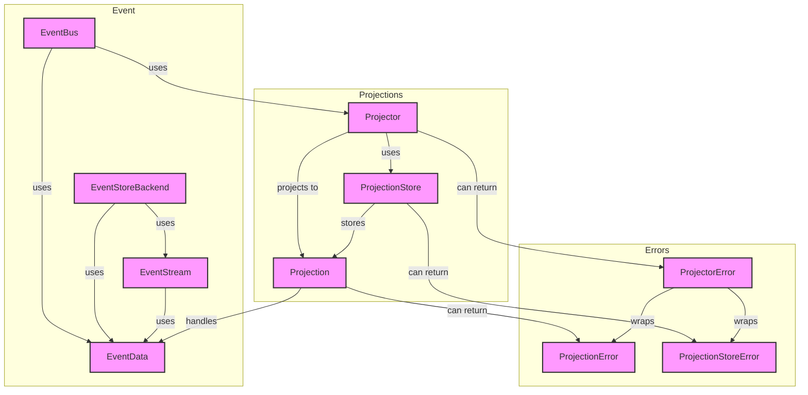

```mermaid
graph TD
    subgraph Event
        EventBus
        EventData
        EventStoreBackend
        EventStream
    end

    subgraph Projections
        Projection
        Projector
        ProjectionStore
    end

    subgraph Errors
        ProjectionError
        ProjectorError
        ProjectionStoreError
    end

    EventBus -- uses --> Projector
    EventBus -- uses --> EventData

    EventStoreBackend -- uses --> EventData
    EventStoreBackend -- uses --> EventStream

    EventStream -- uses --> EventData

    Projector -- "projects to" --> Projection
    Projector -- "uses" --> ProjectionStore
    Projector -- "can return" --> ProjectorError

    Projection -- "handles" --> EventData
    Projection -- "can return" --> ProjectionError

    ProjectionStore -- "stores" --> Projection
    ProjectionStore -- "can return" --> ProjectionStoreError

    ProjectorError -- "wraps" --> ProjectionError
    ProjectorError -- "wraps" --> ProjectionStoreError


    classDef trait fill:#f9f,stroke:#333,stroke-width:2px;
    class EventBus,EventData,Projector,Projection,ProjectionStore,EventStoreBackend,EventStream,ProjectionError,ProjectorError,ProjectionStoreError trait
```

