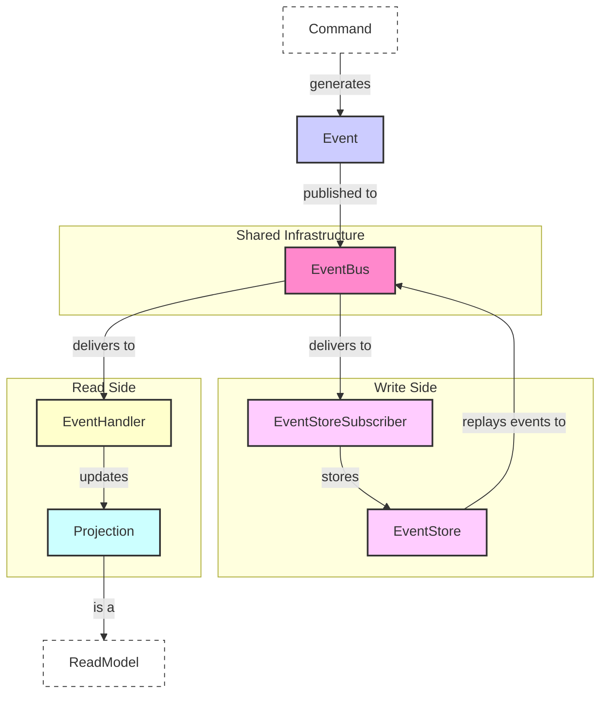

```mermaid
graph TD
    Command -- generates --> Event;
    Event -- published to --> EventBus;

    subgraph "Shared Infrastructure"
        EventBus
    end

    subgraph "Write Side"
        EventBus -- delivers to --> EventStoreSubscriber;
        EventStoreSubscriber -- stores --> EventStore;
    end


    subgraph "Read Side"
        EventBus -- delivers to --> EventHandler;
        EventHandler -- updates --> Projection;
    end

    EventStore -- "replays events to" --> EventBus;
    Projection -- is a --> ReadModel;

    style Command fill:#fff,stroke:#333,stroke-width:1px,stroke-dasharray: 5 5
    style Event fill:#ccf,stroke:#333,stroke-width:2px
    style EventBus fill:#f8c,stroke:#333,stroke-width:2px
    style EventStoreSubscriber fill:#fcf,stroke:#333,stroke-width:2px
    style EventStore fill:#fcf,stroke:#333,stroke-width:2px
    style EventHandler fill:#ffc,stroke:#333,stroke-width:2px
    style Projection fill:#cff,stroke:#333,stroke-width:2px
    style ReadModel fill:#fff,stroke:#333,stroke-width:1px,stroke-dasharray: 5 5
```

