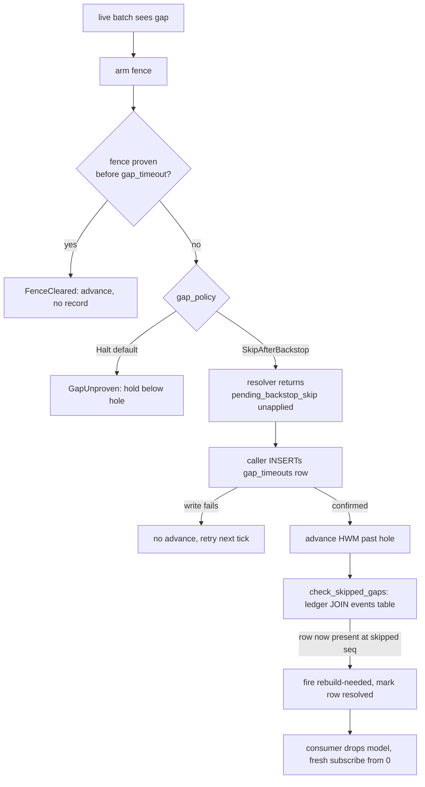

# Spec 0030: Sequence-burn resilience for ReplayAlways subscribers

**Issue:** Linear [CLOUD-261](https://linear.app/catallactical/issue/CLOUD-261) · **Parent:** CLOUD-259 · **Sequel to:** specs 0026 / 0027 / 0028 · **Status:** Implemented on branch `cloud-261` (`bed756b..db70e83`). This document is the condensed reference: why the work was done and what shipped. The delivery plan, numbered requirements, and test-plan mechanics have been dropped — the code and the Implementation section below supersede them.

**Background material kept:** `specs/0030-cloud261-discovery.md` and the four probe reports under `docs/probes/cloud261-*-20260915.md` (burn-wedge, failure-chain, design-space, alloc-cost). Every measurement quoted here comes from those.

---

## 1. Problem

`epoch_events.global_sequence` is assigned by a column `DEFAULT nextval(...)` (m002), evaluated per row inside the caller's insert transaction. PostgreSQL sequences are non-transactional, so a rolled-back insert **permanently burns** every value it drew. Under sustained load these burns are endemic — CLOUD-259 observed three in one acceptance session.

A burn below an in-flight bootstrap can deterministically wedge a fail-closed `ReplayAlways` subscriber:

1. The live batch observes the gap and arms the snapshot fence. If the fence stays unproven past `gap_timeout`, the `FailClosed` arm of `advance_contiguous_checkpoint` refuses the backstop and `GapUnproven` fires.
2. The CLOUD-227 guard advances the `ReplayAlways` high-water mark only across an unbroken prefix, so the position pins below the hole.
3. P4b self-heal explicitly excludes `ReplayAlways` wedges, so the subscriber is inert until something re-subscribes it.

### 1.1 Two findings beyond the ticket

**The wedge is conditional.** With default `snapshot_fencing: true` and a plain burn (no long-lived writer), the fence proves the burn and the position crosses the hole in ~1.1 s via `FenceCleared` — no wedge. The wedge reproduces only when the fence is unavailable or unproven: `snapshot_fencing: false` (one burn wedges, `GapUnproven` 5.05 s later, all post-wedge events undelivered), or an unrelated long-lived writer pinning `xmin` below `fence_xmax` past `gap_timeout` — the sustained-load case CLOUD-259 hit. That second case is precisely the in-flight-writer hazard any skip policy must be judged against.

**Once wedged, nothing recovered it.** `GapUnproven` persisted nothing (no halt flag, no ledger row, no DLQ row; the HWM is in-memory only). `release_halt` wrote a checkpoint row a `ReplayAlways` subscriber never reads, so it was a silent no-op whose WARN over-promised. A fresh `subscribe()` reset the HWM to 0, re-wedged at the same hole, and double-delivered the sequences immediately above it. And a row that later commits *at* a skipped sequence was never detected, because every bus fetch is `WHERE global_sequence > $1`.

### 1.2 Why two parts

The problem sits on two independent axes, so two complementary levers shipped:

- **Part A — `GapPolicy::SkipAfterBackstop` (primary, consumer-driven).** An opt-in per-subscriber recovery contract for fold-style `ReplayAlways` projections. Additive, no migration, **zero write-path cost**. It exists because catacloud carries ~530 lines of generation-chain halt-resilience (CLOUD-259 Phase 3, `614c06ae`) compensating for exactly this chain — working integration-layer machinery standing in for a framework gap.
- **Part B — opt-in `AllocationMode::PerTxnCounter` (secondary, removes gaps at the source).** Draws each transaction's sequence values from a counter row inside the insert transaction, so rollback and crash burn **zero**. It taxes every writer with counter-row serialization (3.5–4.4× slower at K=1), so it is opt-in and `Nextval` remains the default.

A deployment may run A alone, B alone, or both (B for its own writers, A as belt-and-braces for residual genuine holes).

---

## 2. What shipped

### 2.1 Part A — `GapPolicy`

`GapPolicy { Halt (default), SkipAfterBackstop }` lives in `epoch_core` beside `FailureMode`/`SubscriptionMode`, with a defaulted `gap_policy()` on `EventObserver`/`Projection`/`Saga` and forwarding through `ProjectionHandler`/`SagaHandler`/`SagaAdapter`. `Halt` is byte-for-byte today's behaviour.

**Record-then-advance.** The existing gap-timeout recorder is fire-and-forget (spawned INSERT, log-on-failure), which is fine for the fail-open path but not here: an unrecorded skip is a skip detection can never see, silently voiding the safety contract. So the responsibility is split. `advance_contiguous_checkpoint` is DB-free and cannot confirm a ledger write, so it **offers** the skip back unapplied as `AdvanceOutcome::pending_backstop_skip`; the caller confirms the `epoch_event_bus_gap_timeouts` row synchronously and only then advances the HWM. On write failure nothing advances — the subscriber stays in the refused-backstop posture and retries on a later tick.

**Late-materialization detection.** `PgEventBus::check_skipped_gaps()` joins unresolved ledger rows against the bus's configured events table. Bus scoping is load-bearing: `bus_name` *is* the configured events table, and gap tests run on isolated tables, so a literal join against `epoch_events` would detect nothing and a `with_table` deployment would silently never detect. Each hit fires a `RebuildNeededCallback` carrying `(subscriber_id, skipped_sequence)` and marks that row resolved on the full `(bus_name, subscriber_id, skipped_sequence)` key — keying on the bus/seq pair alone would resolve other subscribers' rows and swallow their callbacks. Without the resolve the scan would re-fire forever. An optional `gap_scan_interval` runs the scan automatically.

**Guardrail.** `subscribe()` rejects `SkipAfterBackstop` + `Checkpointed` with the new `PgEventBusError::InvalidSubscriptionConfig`. Advancing past a hole under a persisted checkpoint would violate spec 0027 §3.3; refusing the combination at registration confines the inversion to a subscriber whose position is ephemeral by construction. Enforced in `epoch_pg` only — `epoch_mem` allocates no sequence numbers and imposes no gap policy, so it accepts the combination silently (a documented limitation, not a hazard).

**The safety argument (why `Halt` stays the default).** A skip is decided at backstop time, i.e. while the fence is by definition still pinned — exactly when an in-flight writer may still commit the skipped sequence. The contract is safe **only** for fold-style `ReplayAlways` projections whose state is a pure function of currently-present rows: for those a transiently-missing row means a transiently-incomplete fold, detected by the scan and healed by a rebuild. It is not a general-purpose "skip gaps" switch.

**Rebuild semantics.** A `ReplayAlways` rebuild is, and stays, a fresh `subscribe()` from 0 with a fresh model; no start-position parameter was added. The exposure window for a skipped-then-late row is bounded by the lifetime of the in-memory model. The design's job is to *trigger* that rebuild promptly and audibly, not to perform it — epoch cannot rebuild a consumer's model for it.

### 2.2 Part B — `AllocationMode`

`AllocationMode { Nextval (default), PerTxnCounter }`, resolved once at `PgEventStore` construction (store-wide, not per subscriber). Under `Nextval` the write path is untouched: column omitted, DEFAULT fires, `RETURNING global_sequence` reads it back, no counter row touched.

Under `PerTxnCounter`, migration **m014** supplies `epoch_events_sequence_counter(name TEXT PRIMARY KEY, val BIGINT NOT NULL)`, keyed **per events table** — `events_table` is configurable via `with_table` and every insert SQL is formatted with it, so a single `'events'`-keyed row would collide across tables. The insert path draws `+K` once per transaction (`UPDATE ... SET val = val + K ... RETURNING val`) inside the caller's transaction and supplies the values explicitly. A missing counter row fails the insert; there is deliberately no silent fallback to `nextval`.

**Zero burn, measured.** A rolled-back transaction rewinds the counter (uncommitted MVCC version discarded) and a terminated backend aborts it — zero burn on both legs.

**Fence-safe by construction, so no gap-machinery change.** The counter-row lock serializes writers, so sequence order equals commit order and a missing sequence's writer, if any, held its xid inside the same transaction that drew the value — exactly the premise the fence already assumes under `nextval`. Nothing in `advance_contiguous_checkpoint`, the snapshot query, or the gap-timeout machinery was touched.

**Opt-in transition.** The migration alone is not sufficient: while a deployment still runs `Nextval`, writers keep advancing the sequence past any earlier seed, so a later opt-in could draw colliding values. So the new **fallible async** constructors `with_allocation_mode` / `with_allocation_mode_and_upcasters` re-seed the per-table counter to `GREATEST(counter, sequence last-assigned (is_called-aware), MAX(global_sequence))` on every construction, creating the row if absent, and **fail construction** on re-seed failure. (The pre-existing `with_table` swallows DB failures with a warn; warn-and-continue was explicitly forbidden here.) The operator's half is quiescing `Nextval` writers before the one-way switch.

### 2.3 Adjacent fix

`release_halt`'s success WARN no longer claims "delivery resumes from N" for a `ReplayAlways` subscriber, which never reads the checkpoint row the call writes. It now states plainly that such a subscriber is not resumed and that the remedy is a fresh `subscribe()`. No `ReplayAlways` recovery path was added to `release_halt`.

---

## 3. Contract changes and their limits

- **Spec 0026 R5 is amended, for the opt-in class only.** "Readiness MUST NOT report caught-up while a checkpoint is legitimately held below a hole" no longer holds for `SkipAfterBackstop` + `ReplayAlways`: `wait_until_caught_up` **will** report caught-up across a skipped hole. For that class it is the honest report — nothing is persisted and nothing is held below the hole — and the residual divergence is what detection-then-rebuild heals.
- **Spec 0027 §3.3 is clarified, not amended.** "A persisted checkpoint MUST NEVER lead the in-memory one" holds untouched for every class: the opt-in class persists no checkpoint, and the one configuration that could violate it is refused at registration.
- **Spec 0026's fence proof is untouched.** `FenceCleared` still advances under both allocation modes.
- **One minor breaking change:** `PgEventBusError` is not `#[non_exhaustive]`, so the new `InvalidSubscriptionConfig` variant breaks downstream exhaustive matches. Documented in CHANGELOG.
- **`epoch_mem` is untouched** — it allocates no sequence numbers.

---

## 4. Rejected and deferred

- **Cached-block allocation — rejected.** Fast on the hot path, but it breaks the fence premise: a block reserved and committed ahead of time means the future writer of a missing sequence may hold no xid at gap-detection, so a fence-"proven" gap can still materialize rows from below. Fixing that means reworking fence semantics — a far larger and riskier change than the allocator itself. Per-txn exact allocation was chosen precisely because it needs no fence rework.
- **Making `PerTxnCounter` the default — deferred.** The 3.5–4.4× write tax at K=1 is the wrong thing to impose by default on a write-hot framework to fix a *conditional* wedge. Flipping the default is a separate release decision to be made behind production data.
- **A live switch-back path from `PerTxnCounter` to `Nextval` — not built.** One-way for this release; it eliminates the mixed-allocator concurrency hazard by construction. Switching back remains a documented operator procedure (quiesce, `setval` the events-table sequence past the counter's `val`, restart under `Nextval`). A runtime-switchable knob would be its own ticket.
- **Catch-up/live double-delivery after a fresh subscribe over a hole — ticketed separately.** `processed_ahead` guards the live path but not the catch-up pass, so a fresh subscribe over *any* hole double-delivers the sequences just above it (observed counts `(3,2)`, `(4,2)`). This is a distinct correctness bug well beyond CLOUD-261 and was deliberately left out of scope rather than dragged into the catch-up/live dedup boundary.
- **Catacloud-side heal removal** — tracked in catacloud; this spec only provides the contract it consumes.

---

## 5. Known gaps

- **The automatic gap scan is off by default.** `gap_scan_interval` defaults to `None`. A consumer that opts into `SkipAfterBackstop` but never sets it, and never calls `check_skipped_gaps()`, gets the skip and the audit row but no rebuild trigger — the second half of the safety contract is theirs to enable.
- **`epoch_mem` accepts `SkipAfterBackstop` + `Checkpointed` silently.** The guardrail is `epoch_pg`-only. Harmless (nothing there can wedge or skip), but it means the config error is not caught in mem-backed tests.
- **The opt-in `Nextval` → `PerTxnCounter` transition depends on an operator quiesce.** The construction-time re-seed is collision-free only if no `nextval` writer is still running; there is no in-code enforcement of the quiesce.
- **In-file test label collision:** the P7 review-finding pin `test_per_txn_counter_missing_counter_row_fails_the_insert` carries an in-file comment label `T7b-pin`, but `T7b` already names an unrelated CLOUD-227 test group in the same file. Cite that pin by function name, not label.

---

## 6. Implementation

Branch `cloud-261`, branch point `bed756b`. Part A is P1–P5; Part B is P6–P8.

| Area | Commit | Key files |
| --- | --- | --- |
| `GapPolicy` trait surface + forwarding chain | `818b597` | `epoch_core/src/event_store.rs` (enum at `:345`), `epoch_core/src/projection.rs`, `epoch_core/src/saga.rs` |
| `subscribe()` gap-policy resolution + `InvalidSubscriptionConfig` guardrail | `abc3f1b` | `epoch_pg/src/event_bus/mod.rs` (variant `:1251`, rejection `:4220`) |
| `SkipAfterBackstop` resolver arm + record-then-advance audited skip | `0b91d55` | `epoch_pg/src/event_bus/subscriber_state.rs` (`AdvanceOutcome` `:268`, `pending_backstop_skip` `:288`), `epoch_pg/src/event_bus/mod.rs` |
| Late-materialization detection + rebuild callback | `db05d88` | `epoch_pg/src/event_bus/mod.rs` (`check_skipped_gaps` `:3404`), `epoch_pg/src/event_bus/config.rs` (`RebuildNeededCallback` `:272`, `gap_scan_interval` `:507`) |
| `release_halt` WARN honesty + `Halt` regression pins + Part A docs/CHANGELOG | `b4843bb` | `epoch_pg/src/event_bus/mod.rs`, `CHANGELOG.md` |
| m014 counter table + `AllocationMode` + fallible constructors | `b6d45d9` | `epoch_pg/src/migrations/m014_create_events_sequence_counter.rs`, `epoch_pg/src/event_store.rs` (enum `:152`, `with_allocation_mode` `:309`) |
| `PerTxnCounter` write path (+K per txn, zero-burn) | `e7eb451` | `epoch_pg/src/event_store.rs` (allocation `:418-436`, `store_event` `:764`) |
| `AllocationMode` rustdoc contract + Part B CHANGELOG + traceability reconciliation | `db70e83` | `epoch_pg/src/event_store.rs`, `CHANGELOG.md` |

### Tests

Unit tests for the forwarding chain live in `epoch_core/src/projection.rs` and `epoch_core/src/saga.rs`. All integration tests are in `epoch_pg/tests/pgeventbus_integration_tests.rs`, DB-gated (`EPOCH_REQUIRE_DB=1`) and `#[serial]`, using `isolated_events_table` with relative sequence assertions only.

Part A: `test_subscribe_gap_policy_guardrail_skip_after_backstop_replay_always_only`, `test_skip_after_backstop_advances_hwm_past_unproven_gap`, `test_skip_after_backstop_audited_row_precedes_hwm_advance`, `test_skip_after_backstop_ledger_failure_withholds_skip_then_retries`, `test_late_materialization_detected_fires_rebuild_once`, `test_release_halt_warn_does_not_promise_resume_for_replay_always`, `test_readiness_reports_caught_up_across_skipped_hole`, plus the `GapPolicy::Halt` default-unchanged pin at `:9492` and the two pre-existing fail-closed suite tests kept green.

Part B: `test_per_txn_counter_rollback_burns_nothing`, `test_per_txn_counter_crash_burns_nothing` (terminates a dedicated connection via `pg_terminate_backend`), `test_per_txn_counter_allocates_once_per_transaction`, `test_per_txn_counter_construction_reseeds_counter_row`, `test_opt_in_transition_assigns_above_every_previous_value`, `test_per_txn_counter_concurrent_writers_are_contiguous`, `test_per_txn_counter_missing_counter_row_fails_the_insert`, and the default-mode regression gates `test_nextval_rollback_still_burns_and_touches_no_counter` / `test_nextval_allocation_mode_touches_no_counter_row`.

---

## Appendix A — Requirement and anchor index

The condense pass (`493d6f4`) dropped the numbered §3.x/§5.x sections, the R1–R15
requirement list, the OQ records, and the T0–T15 test plan. ~51 rustdoc comments,
internal comments, and test labels still cite those anchors. This index is the
redirect: every legacy anchor below resolves to the section above that now carries
the behaviour. The citation sites were deliberately left unedited.

### Sections

| Legacy 0030 anchor | Now |
| --- | --- |
| §3.1 (Part A design, record-then-advance) | §2.1 |
| §3.2 (rebuild semantics) | §2.1 "Rebuild semantics" |
| §3.3 (late-materialization detection) | §2.1 "Late-materialization detection" |
| §3.4 (in-flight-writer safety argument) | §2.1 "The safety argument" |
| §3.5 (adjacent defects) | §2.3 |
| §3.6 (Part B allocator, opt-in transition) | §2.2 |
| §3.7 (readiness amendment) | §3, first bullet |
| §5.1 (A vs B vs both) | §1.2 |
| §5.2 (per-txn vs cached blocks) | §4, "Cached-block allocation — rejected" |

### Requirements

| Legacy 0030 anchor | Now |
| --- | --- |
| R1 `GapPolicy` enum + forwarding chain | §2.1, para 1 |
| R2 `subscribe()` guardrail + `InvalidSubscriptionConfig` | §2.1 "Guardrail"; §3, bullet 4 |
| R3 skip instead of wedge past `gap_timeout` | §2.1 "Record-then-advance" (flowchart arm `SkipAfterBackstop`) |
| R4 confirmed ledger row before HWM advance; write failure withholds | §2.1 "Record-then-advance" |
| R5 bus-scoped detection + rebuild callback, resolve-once | §2.1 "Late-materialization detection" |
| R6 `Halt` byte-for-byte unchanged | §2.1, para 1 |
| R7 no Part A migration; rustdoc carries the safety contract | §1.2 ("Additive, no migration") |
| R8 `release_halt` WARN honesty | §2.3 |
| R9 spec 0026 R5 amended for the opt-in class only | §3, bullet 1 |
| R10 `AllocationMode`, zero default-mode cost | §2.2, para 1 |
| R11 m014 counter table + fallible re-seeding constructors | §2.2 "Opt-in transition" |
| R12 `+K` drawn once per transaction | §2.2, para 2 |
| R13 zero burn on rollback and on crash | §2.2 "Zero burn, measured" |
| R14 fence premise holds, no gap-machinery change | §2.2 "Fence-safe by construction" |
| R15 `AllocationMode` rustdoc + CHANGELOG | shipped; see §6 row `db70e83` |

### Open questions and test labels

- **OQ-3** — no `ReplayAlways` recovery path added to `release_halt`: §2.3.
- **OQ-4** — `AllocationMode` is a one-way, deployment-lifetime choice; switch-back is a
  documented operator procedure: §2.2 "Opt-in transition" and §4, bullet 3.
- **T0–T15** were the paper test plan. The shipped tests that discharge them are listed
  by function name in §6 "Tests"; T0 is the `epoch_core` forwarding-chain unit test, T1–T8
  are the Part A integration tests, T9–T15 the Part B ones. Cite shipped tests by function
  name — the `T*` labels are historical, and `T7b` additionally collides with an unrelated
  CLOUD-227 group in the same file (§5, last bullet).
